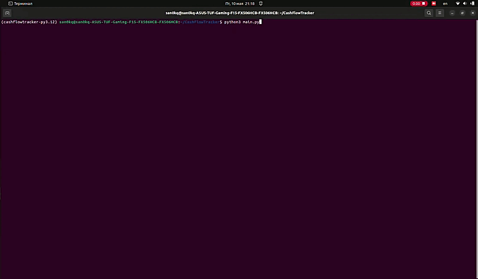

# Учёт данных доходов и расходов

Привет!

Это тестовое задание, в котором необходимо написать приложение для учёта данных доходов и расходов. Реализация через консоль без использования фреймворков. База данных файловая (в данном случае json). В приложении использована простейшая N-Layer архитектура с использованием нескольких простых паттернов, таких как DAO и DTO. В приложении использован как ООП подход, так и функциональное программирование, так как автор считает это уместным в данной ситуации. Добавлены unittests.

## Технические детали

- **Python 3.12**: Приложение работает на Python 3.12.
- **Виртуальное окружение**: Можно запустить виртуальное окружение Poetry (или обычное, используя requirements.txt). Но оно использовалось только для работы линтеров при разработке.

## Запуск приложения

Чтобы запустить программу, достаточно просто запустить main.py с корня проекта.

```bash
python3 main.py
```

Для удобства проверки, в базе данных (db.json) будет уже несколько записей, но вы можете их удалить.

## Использование

При запуске приложения появится главное меню, навигация по которому осуществляется с помощью набора чисел в консоли. В некоторых пунктах главного меню будут открываться другие подменю. Например, чтобы удалить или изменить запись, вам необходимо сначала просмотреть все существующие записи и там выбрать интересующую (при просмотре всех записей используется пагинация). После чего появится нужное подменю.

Чтобы отсортировать записи по категории, дате или сумме, достаточно зайти в нужное подменю через главное меню и выбрать нужный ключ для сортировки.

Также с главного меню доступен просмотр текущего баланса.

## Демонстрация

Ниже прикреплена GIF-ка с демонстрацией работы приложения.


